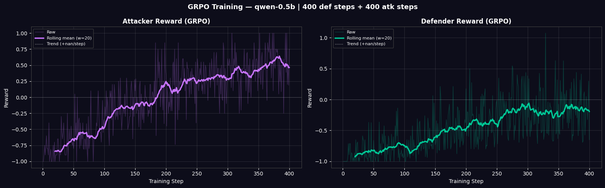
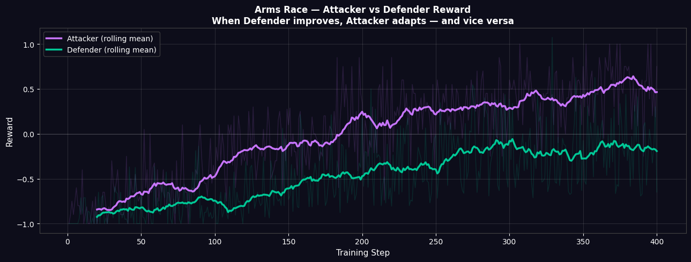

# AI Incident Response — Red Team vs Blue Team

A competitive multi-agent environment built on [OpenEnv](https://github.com/meta-pytorch/OpenEnv) where an **Attacker** (red team) and a **Defender** (blue team) duel over a simulated IT system. Both agents are LLMs trained with **GRPO** (Group Relative Policy Optimization).

- **HF space:** [RapidOrc121/Incident_Reponse_env](https://huggingface.co/spaces/RapidOrc121/Incident_Reponse_env)
- **WandB:** [IR-grpo run](https://wandb.ai/gurmann-ajmani/IR-grpo/runs/0xuagwep)
- **Attacker model:** [RapidOrc121/Incident-Response-attacker](https://huggingface.co/RapidOrc121/Incident-Response-attacker)
- **Defender model:** [RapidOrc121/Incident-response-defender](https://huggingface.co/RapidOrc121/Incident-response-defender)
- **Colab:** [IR GRPO training notebook](https://colab.research.google.com/#fileId=https%3A//storage.googleapis.com/kaggle-colab-exported-notebooks/gurmann/ir-grpo-training.e73d777b-039a-4a8e-86c9-0aafb538860e.ipynb%3FX-Goog-Algorithm%3DGOOG4-RSA-SHA256%26X-Goog-Credential%3Dgcp-kaggle-com%2540kaggle-161607.iam.gserviceaccount.com/20260426/auto/storage/goog4_request%26X-Goog-Date%3D20260426T093658Z%26X-Goog-Expires%3D259200%26X-Goog-SignedHeaders%3Dhost%26X-Goog-Signature%3D558d24a25e491bb11e10d4b6d8790e2963294b76bb865ee7a6c47fbd5bd87b036b3ecc629b1f42644acb4a798e712eb18e07e28cf01e0be50588d68b0a8a7d5b9d42e42193d0dc742faff11c1c9238469e000e3125d52c5841cafb486ec7addf9f7867ec352409228f3ce903a94e4bfa19c3282003918c949c5cfed69e6b0a99c3bb5db42e777b6c594ca7e07a1d3ab93edc27d262dfda44297604420d4dee808ba0497ec9d9dc428ebc2e6c9c0c423e61eac525f4f87dc105d72fbf193330fa0597508670242dc33af4b1752913a8e9bdf69423a765952979130ca908a027adcb95f3fd365050f69d3e202f8901cccdff1d25b13f7d82ba56f11814c88b263e)
- **Kaggle run:** [gurmann/qwen0-5b](https://www.kaggle.com/code/gurmann/qwen0-5b)

---

## Environment overview

Each episode is a 3-step duel. Roles alternate: attacker acts first, then defender responds.

| Property | Detail |
|---|---|
| Episode length | 3 turns |
| Roles | Attacker, Defender |
| Action format | Single-line structured string |
| Base model | Qwen2.5-0.5B-Instruct (LoRA fine-tuned) |
| Training algorithm | GRPO (phase-alternating) |
| Framework | Unsloth + HF TRL |

---

## Action space

### Attacker (red team)

The attacker studies the log hint, system profile, and the defender's recent move history. It outputs exactly one line:

```
ATTACK: <PHISH|BRUTEFORCE|DRIVEBY|RANSOM|SQLI|RCE|LPE|SUPPLYCHAIN>
```

| ID | Action | Description |
|----|--------|-------------|
| 0 | PHISH | Credential-harvesting phishing campaign |
| 1 | BRUTEFORCE | Automated login brute-force |
| 2 | DRIVEBY | Drive-by browser exploit |
| 3 | RANSOM | Ransomware deployment |
| 4 | SQLI | SQL injection attack |
| 5 | RCE | Remote code execution |
| 6 | LPE | Local privilege escalation |
| 7 | SUPPLYCHAIN | Supply-chain compromise |

### Defender (blue team)

The defender sees the attacker's chosen move plus a rolling summary of the attack history. It outputs exactly one line:

```
DEFEND: <MFA|PATCH|EDR|BACKUP|WAF|LEASTPRIV|SBOM|ROTATEKEYS>
```

| ID | Action | Description |
|----|--------|-------------|
| 0 | MFA | Enforce multi-factor authentication |
| 1 | PATCH | Apply OS/software patches |
| 2 | EDR | Endpoint detection and response |
| 3 | BACKUP | Verify and restore from backups |
| 4 | WAF | Web application firewall |
| 5 | LEASTPRIV | Enforce least-privilege access |
| 6 | SBOM | Software bill-of-materials audit |
| 7 | ROTATEKEYS | Rotate API keys and credentials |

---

## Environment mechanics

### Scenarios

Each episode randomly samples one of 8 curated scenarios (e.g. `bulk_phish`, `api_brute`, `backup_gap`). Each scenario has:
- A **log hint** visible to both agents (partial observability)
- A **system profile** (MFA availability, EDR installed, etc.)
- A hidden **weakness** (the optimal attack for that scenario)
- A scenario-specific **correct counter** (the optimal defense)

### Partial observability and memory

Neither agent sees the scenario's weakness label directly. They must infer it:

- **Attacker** sees `Defender_recent(N): MFA=2 EDR=1 PATCH=0 ...` — a rolling count of the defender's last N moves.
- **Defender** sees `Attacker_recent(N): PHISH=3 RANSOM=0 ...` and `Recent_breaches(N): PHISH=2 ...` — counts of recent attacks and which ones succeeded.

This drives genuine opponent-modeling: "the defender has been using MFA a lot, so I should switch to RANSOM."

### Attack chains

Certain attacks unlock follow-on attacks when they breach:

| Initial attack | Unlocks |
|---|---|
| PHISH | LPE, RANSOM |
| BRUTEFORCE | RANSOM, DRIVEBY |
| DRIVEBY | RCE, LPE |
| SQLI | RCE, LPE |
| RCE | RANSOM, SUPPLYCHAIN |
| LPE | RANSOM, SUPPLYCHAIN |

This makes the game path-dependent: the attacker can chain moves across steps, and the defender must adapt to escalating threats.

### Health

System health starts at 100%. Each breach applies damage:

| Attack | Damage |
|---|---|
| RANSOM, RCE, SUPPLYCHAIN | 35–40% |
| LPE, DRIVEBY | 25% |
| SQLI | 20% |
| PHISH, BRUTEFORCE | 15% |

Health status: **STABLE** (>=80%), **DEGRADED** (50–79%), **CRITICAL** (<50%).

---

## Reward function

The reward function is dense and hard to game:

**Defender reward:**
- `+1.0` for the correct scenario-specific counter
- `+0.3` recovery bonus when health is DEGRADED or CRITICAL
- Partial credit (0.1–0.6 range) for "somewhat helpful" wrong defenses (e.g. EDR vs DRIVEBY gets more credit than MFA vs DRIVEBY)
- `+health * 0.3` health-preservation shaping bonus each step
- `-1.0` format penalty for malformed output

**Attacker reward:**
- `+1.0` for hitting the scenario weakness
- `+0.8` for successful follow-on breach attacks (slightly discounted)
- `-0.2` to `-0.3` for irrelevant attacks
- `-1.0` format penalty for malformed output

The partial-credit proxy table prevents "always pick EDR" or "always pick PATCH" from being a winning strategy — the correct answer changes per scenario.

---

## Training pipeline

Training uses phase-alternating GRPO:

1. Generate prompt datasets sampling from all 3 episode steps (40% step-1, 35% step-2, 25% step-3 distribution).
2. Train the **attacker** for 400 GRPO steps.
3. Refresh prompt datasets using rollouts from the updated attacker.
4. Train the **defender** for 400 GRPO steps.
5. Run evaluation rollouts (breach rate, health, reward vs baseline).

This creates an arms-race dynamic visible in the reward curves below.

---

## Results

### Training reward curves



Both attacker and defender reward trends upward over training steps. The rolling mean (w=20) shows stable improvement, not noise.

### Arms race



The combined plot shows the classic arms-race signature: attacker reward rises, then defender reward rises as it learns to counter, then attacker adapts again.

### Evaluation: baseline vs trained

The table below compares `mean_reward`, `std_reward`, `max_reward`, and `format_valid_rate` for the untrained base model (Qwen2.5-0.5B) vs GRPO-trained checkpoints across 50 evaluation episodes each.

| Model | mean_reward | std_reward | max_reward | format_valid_rate |
|---|---|---|---|---|
| attacker_baseline | 0.136 | 0.538799 | 1.0 | 1.0 |
| attacker_trained | 0.904 | 0.325552 | 1.0 | 1.0 |
| defender_baseline | -0.840 | 0.542586 | 1.0 | 0.7 |
| defender_trained | -0.440 | 0.897998 | 1.0 | 1.0 |

GRPO clearly improved performance: trained policies achieve higher mean reward and near-perfect format validity, while the baseline model frequently produces malformed output and scores negative mean reward from format penalties.
The trained defender explores a wider range of defenses across scenarios — higher variance reflects context-dependent adaptation rather than instability.
The trained attacker went from not breaching the system at all to breaching the system most of the times


---

## Trained model checkpoints

The interactive playground on the Space loads these adapters live:

- Attacker: [RapidOrc121/Incident-Response-attacker](https://huggingface.co/RapidOrc121/Incident-Response-attacker)
- Defender: [RapidOrc121/Incident-response-defender](https://huggingface.co/RapidOrc121/Incident-response-defender)

Both are LoRA adapters on top of `unsloth/qwen2.5-0.5b-instruct-unsloth-bnb-4bit`.

---

## Project structure

```
incident_response_env/
├── README.md                                   this file
├── qwen0-5b.ipynb                              full training + eval notebook (embedded in Space)
├── training+eval.ipynb                         cleaned reference notebook
├── assets/
│   ├── training_curves.png                     attacker + defender reward curves
│   ├── arms_race.png                           combined arms-race plot
│   └── eval_table.html                         baseline vs trained eval table
├── models.py                                   Action + Observation data models
├── client.py                                   Python client wrapper
├── pyproject.toml
├── uv.lock
└── server/
    ├── app.py                                  FastAPI + Gradio application
    ├── incident_response_env_environment.py    core environment logic
    ├── custom_ui.py                            Gradio UI with notebook embed
    ├── model_runner.py                         lazy GRPO model loading
    └── Dockerfile
```
